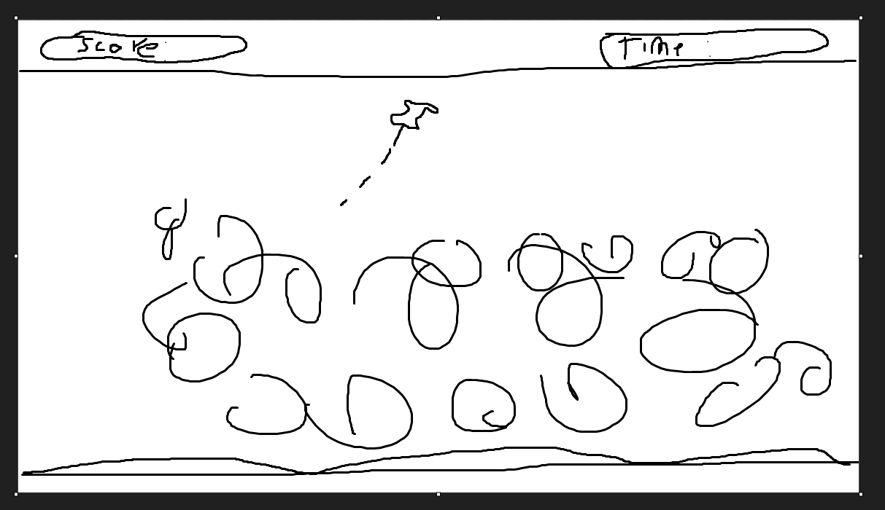

# M1GDV_M2
---
# Inhoud

- [1.1 GameConcept](#gameconcept)
- [1.2 Randomitems](#random-items)

---

# 1.1 GameConcept
## Titel game: PinDrop

## Genre
Physics-based arcade puzzelgame.
## Beschrijving
De speler moet een pin schieten op ballonnen en sommige zijn stenen en dan bounced ie ergens naartoe en hij valt op een stukje van een houtboord. 

---

# 1.2 Random items

Beschrijving: Herhaling van datatypes en we hebben met private gewerkt en random items in de console laten appearen als je op een bepaald knop klikt. ik heb nmr1 voor een willekeurig item, en nmr 2 voor alle items.

Script: [Randomitems.cs](Assets/Scripts/randomitems.cs)