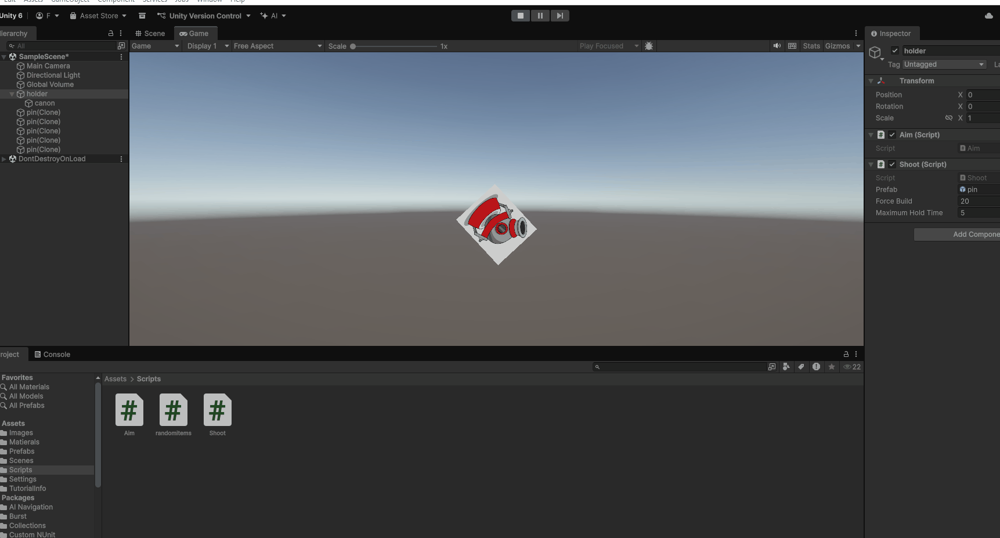

# M1GDV_M2
---
# Inhoud

- [Link naar lessen](#link-naar-lessen)
- [1.1 GameConcept](#gameconcept)
- [1.2 Randomitems](#random-items)
- [2.2 Canon](#22-peggle-mikken-line-renderer)

---

# Link naar lessen
https://github.com/djsjollema/lessen-gamedevelopment/tree/main/M2/GDV

# 1.1 GameConcept
## Titel game: PinDrop

## Genre
Physics-based arcade puzzelgame.
## Beschrijving
De speler moet een pin schieten op ballonnen en sommige zijn stenen en dan bounced ie ergens naartoe en hij valt op een stukje van een houtboord. De speler heeft 1 pin. als de pin een lucky ballon hit dan krijgt die nog een pin en kan je de scoren verhogen. als de pin de grond aanraakt dan word de definitieve score uitgerekend. Als de pin een minimale score heeft behaald dan word het level reset en moet je een hogere scoren krijgen

---

# 1.2 Random items

Beschrijving: Herhaling van datatypes en we hebben met private gewerkt en random items in de console laten appearen als je op een bepaald knop klikt. ik heb nmr1 voor een willekeurig item, en nmr 2 voor alle items.

Script: [Randomitems.cs](Assets/Scripts/randomitems.cs)

---

# 2.2 Peggle Mikken Line Renderer

Beschrijving: Canon gemaakt met prefabs, colliders, images

Scripts: [Shoot.cs](Assets/Scripts/Shoot.cs) [Aim.cs](Assets/Scripts/Aim.cs)

---
